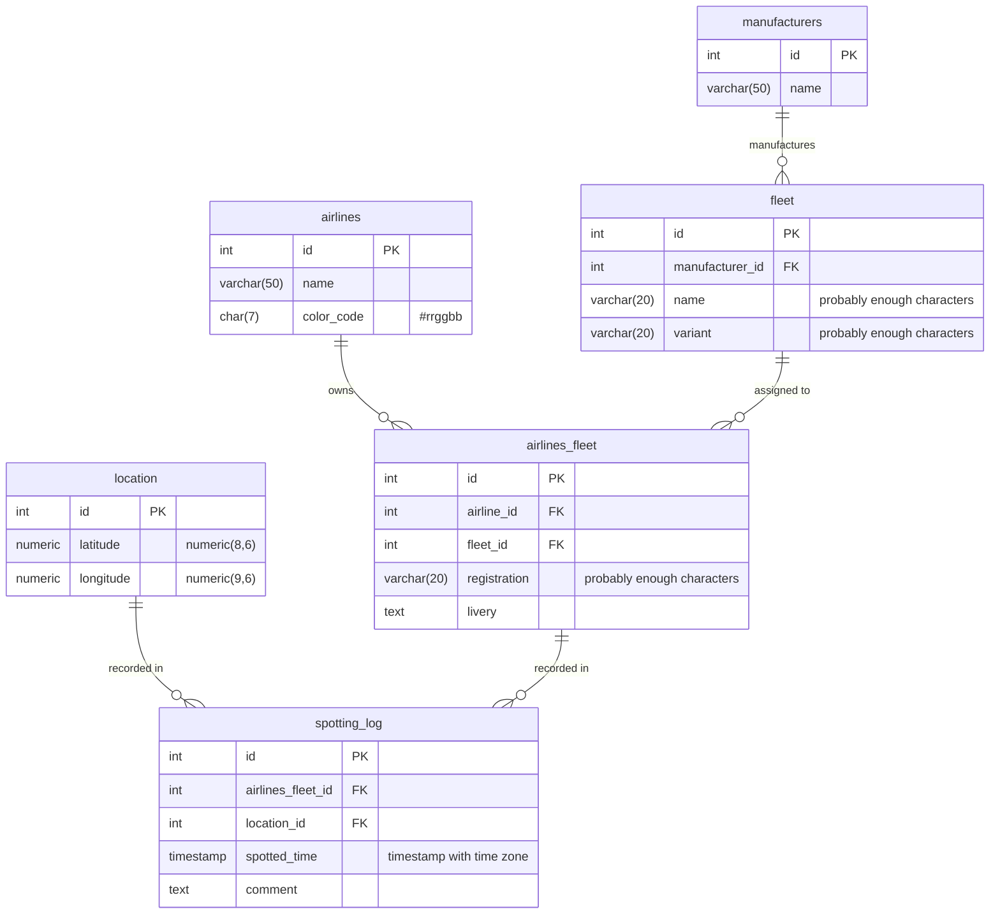

# Plane Spotting Log Server

## Entity Relationship Diagram

```mermaid
erDiagram
  airlines {
    int id PK
    varchar(50) name
    char(7) color_code "#rrggbb"
  }

  manufacturers {
    int id PK
    varchar(50) name
  }

  fleet {
    int id PK
    int manufacturer_id FK
    varchar(20) name "probably enough characters"
    varchar(20) variant "probably enough characters"
  }

  airlines_fleet {
    int id PK
    int airline_id FK
    int fleet_id FK
    varchar(20) registration "probably enough characters"
    text livery
  }

  location {
    int id PK
    numeric latitude "numeric(8,6)"
    numeric longitude "numeric(9,6)"
  }

  spotting_log {
    int id PK
    int airlines_fleet_id FK
    int location_id FK
    timestamp spotted_time "timestamp with time zone"
    text comment
  }

  manufacturers ||--o{ fleet : "manufactures"
  airlines ||--o{ airlines_fleet : "owns"
  fleet ||--o{ airlines_fleet : "assigned to"
  location ||--o{ spotting_log : "recorded in"
  airlines_fleet ||--o{ spotting_log : "recorded in"
```
